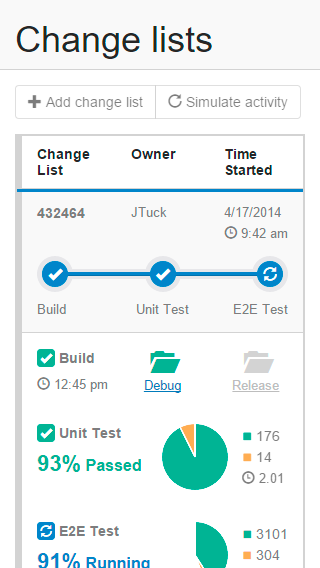
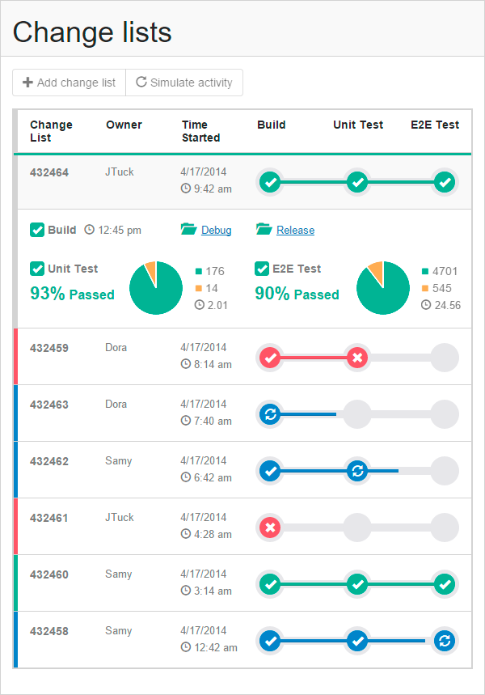

# Table of contents
* [Description](#description)
* [Demo](#demo)
* [Supported browsers](#supported-browsers)
* [Installation](#installation)
* [Testing](#testing)

# Description
This is a sample of a small responsive single-page web app which represents a continuous integration system based on changelists.
Although the app is small, it has complex responsive HTML and CSS.
The app is created with AngularJS and Bootstrap, uses Gulp and Karma as building and testing utilities, and LESS as a CSS pre-processor.

The app uses feature based structure for source code and file type based structure for a build version, and can be used as a starting point for your own projects.

# Demo
A demo is hosted on Heroku ([here](https://frozen-ravine-6349.herokuapp.com/#/home)).

## Phone presentation

## Tablet and larger screens presentation

# Supported browsers

## Desktop
* Chrome 21
* FireFox 29
* Safari 6.1
* Internet Explorer 11
* Opera 12.10

## Mobile
* Android 4.4
* Firefox Mobile 29
* Safari Mobile 7.1
* IE Phone 11
* Opera Mobile 12.10

# Installation
To install the app locally follow the steps below:

1. Clone the repository.
2. Open Bash from the app's directory.
3. Install app's dependencies by executing `npm install` command.
4. Start the app using `gulp start` command. This also builds the app before starting.
5. Open app's home page in your browser ([http://localhost:5000/#/hom](http://localhost:5000/#/home)).

# Testing
The app has a couple of tests. To run the tests execute `gulp unit-test`.
